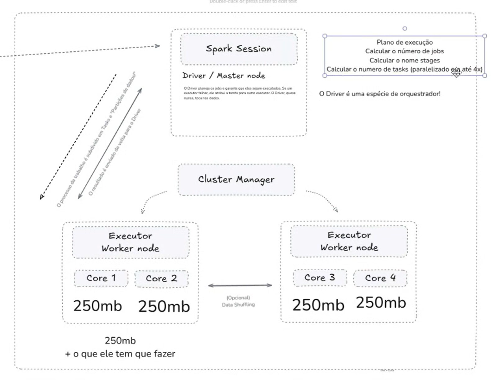

# Multiengine ETL with Databricks and DuckDB


The goal of this project is to practice the use of Databricks and DuckDB in constructing ETL pipelines. It is based on [lvgalvao`s](https://github.com/lvgalvao) 5-day bootcamp on the subject that happened from 2025/01/28 to 2025/01/31.

We`re working with 3 "data ingestion models": one daily, one hourly and one real-time (every 15 seconds), either through API's or RMDB's.

The original bootcamp uses Databricks' enterprise verion to test some more advanced features. In this project, we'll go with the community version, lest AWS syphons my entire back account with hidden background-running services, taxes, and whatnot.


<br>

<table align="center" style="border-collapse: collapse;">
  <tr>
    <td align="center" style="border: none;">
      
      <br> Databricks
    </td>
    <td align="center" style="border: none;">
      
      <br>DuckDB
    </td>
  </tr>
</table>


<br>

<div align="center">

# $\color{goldenrod}{\textrm{Day 1 - Intro}}$

</div>

<div align="center">

## $\color{goldenrod}{\textrm{1.1 - Intro}}$

</div>

Databricks offers a number of advantages when dealing with large volumes of data: not only does it leverages functionalities from Spark - by enabling distributed processing - but it also offers in-memory processing and synergizes well with any storaging solution.

Spark itself has evolved its ecossystem: SparkSQL for querying, SparkMLlib for machine learning, SparkStreaming for low latency. Spark Dataframes interface with a number of languages nowadays: SQL, R, Scala, Java, Python, etc; the more specialized _Datasets_ only work with Scala, but that's for very specific cases.

Spark itself appeared as an open-sourcer processing solution to gain space in the Data Engineering market. Databricks, on the other had, aims to gain the market by selling itself directly to the executive team. It's a ready-to-use toolbox, and it adds new features constantly.
<br>

<div align="center">

## $\color{goldenrod}{\textrm{1.2 - How does it work?}}$

</div>

On the (paid) enterprise version of Databricks, you can customize your cluster: determine the runtime version (e.g. 15.4 LTS (Scala 2.12, Spark 3.5.0)) and the Worker/Driver types (how much memory? how many cores"? minimum and maximum number of workers/drivers?). In the live example, both are m4.large (8GB Memory, 4 Cores), a cheap option. It doesn't use Photon acceleration, it enables auto-scaling and it turns off after 1 hour (ideally 10 minutes for our use-cases). Max spot price can be lowered up to 90% to save some money, after that it starts impacting processing. In the example, we have 1 driver node and 2 executors (worker nodes). Each node is set according to the number of VCPU's e.g. if I have 2 worker machines with 8GB Memory and 2 cores each, I can paralelize tasks 4 times.




- **Driver**: the brain, the manager, the orchestrator, the master node, the single interface between my code and the clusters - my code _never_ reaches a worker directly - and part of the Spark Session, which generates an execution plan e.g. calculate the number of jobs, stages and tasks. It very rarely does computations, and if it _does_, it's probably the most likely candidate for a bottleneck. After the workers do their jobs, the Driver receives their output.

- **Worker**: stfgf


Suppose my aplication only counts the number of rows in a certain dataset. The Spark Session receives the information from my application and allocates the distribution of processing for each of the CPUs in my Executors (or Nodes).  Suppose I have 11 blue boxes to process. In order, it:

1. Verifies if the code is compiled correctly;
2. Creates an execution plan: checks the capacity and allocates work to the Worker nodes. If I have 4 CPUs in total, it allocates 3-3-3-1 blue boxes.
3. Sends the taks and the distributed datasets (blue boxes) to the CPUs.
4. Now it's time for the Workers to work. The task is performed and the blue boxes are counted: the count yields 3-3-3-1 (not blue boxes, just the information!).
5. The Workers perform the *exchange* ritual, where the result from the counting is transferred to a single worker, simplyfing the output back to the Driver node.
6. The selected Worker counts the results from all 4 CPUs and gets the final result: 11. Now it sends the info back to the Driver.

<br>

<div align="center">

## $\color{goldenrod}{\textrm{1.3 - Jobs, Stages, Tasks}}$

</div>

Suppose you run the spark command `spark.run.csv("path").count()`; this action is divided in jobs, stages and tasks:


- each **method** comprises a **job**, so 3 jobs so far.
- you'll have 1 + a **stage** for each **widely transformation** (the ones that have to act on the entire dataset e.g. Order By or Group By).
- tasks are based on our dataset and the number of slots (CPUs) we have available.

---

_Interview quastion_: you have 2 widely transformation, 1 action (read()), and your dataset is 2GB. Standard partition is 128MB. How many jobs, stages and tasks? i.e. you're performing `spark.read().orderby().agg()`

- 1 action = 1 job
- 1 stage (basis) + 1 stage (order by) + 1 stage (agg) = 3
- tasks = 2GB / 128MB = 2048 MB / 128MB = ~16 GB.

---

_Interview quastion_: if you only increase the dataset, what changes? Jobs, stages or tasks?

- Only tasks (you're distributing more partitions)

---

<div align="center">

## $\color{goldenrod}{\textrm{1.4 - Pyspark Dataframe API}}$

</div>

We can, locally, initiate a Spark session with
```
from pyspark.sql import SparkSession

my_spark = SparkSession.builder.appName('test').getOrCreate()
```

Running `my_spark.session_id` will yield the id of this object. Databricks, however, automatically creates a Spark session for us, stored in the variable "spark". Running `spark.session_id` will yield exactly the same id.

With some data imported into the Volume, we can access it through usual metods e.g. `df = spark.read.csv("path/example.csv")`. `df.display` or `df.printSchema()` will output garbage if we don't set options such as `header=True, inferSchema=True`, which is usually done manually in databricks.

There are 3 ways of visualizing data:
- df.show()
- df.head() / df.tail()
- df.display()

Show, head and tail are what's usually called terminal output, or stdout. We can improve "show" a little bit with arguments such as truncate=False, vertical=True, n=1, etc.

Display is optimized for databricks, _and it's dynamic_, you can filter, manipulate, etc. Nothing stops us doing something like `df.limit(5).display() to emulated the head.

There are similarities with libraries such as pandas. For example, we can run `df.describe().display()` to yield some basic descriptive statistics. Or we can use syntax like `df[['first_name']].display()` to filter the dataset, remembering that the display is only used to materialize the results.

We can - and should - also leverage the use of functions:
```
from pyspark.sql.functions import col, concat, lit

df_with_fullName = df.withColumn('fullName', concat(col('first_name'), lit(' '), col('last_name'))).display()
```

Notice that we can bring up columns in different ways, like dot notation of the declarative col function. We can assign the operation to a new variable, and thanks to spark`s _lazy evaluation`, we can run without any in-memory processing.

We can rename the column with `df_renamed_full_name = df_with_fullName.withColumnRenamed('fullName','full_name')` and materialize the operation with `df_renamed_full_name.display()`. Or we can drop the column with `df = df_renamed_full_name.drop('full_name')`, reverting back to the original dataframe.

Filtering is always useful: `df.filter("salary >= 10000").display()` or even `df.filter(df.salary >= 10000).display()`. df.where() also works, for those more SQL oriented.

And so is concatenating transformations: `df.filter(df.salary >= 10000).select('first_name', 'age').display()`

And so is negating expressions: suppose we find a daniel with `df.filter(df.first_name == 'Daniel').display()`, we can exclude it and find everyone else with `df.filter(~(df.first_name == 'Daniel')).display()`
<br>
<br>

<div align="center">

# $\color{goldenrod}{\textrm{Day 2 - }}$

</div>

<div align="center">

## $\color{goldenrod}{\textrm{2.1 - Intro}}$

</div>


<br>
<br>
<br>

<div align="center">

# $\color{goldenrod}{\textrm{Day 3 - }}$

</div>

<div align="center">

## $\color{goldenrod}{\textrm{3.1 - Intro}}$

</div>


<br>
<br>
<br>

<div align="center">

# $\color{goldenrod}{\textrm{Day 4 - }}$

</div>

<div align="center">

## $\color{goldenrod}{\textrm{4.1 - Intro}}$

</div>


<br>
<br>
<br>

<div align="center">

# $\color{goldenrod}{\textrm{Day 5 - }}$

</div>

<div align="center">

## $\color{goldenrod}{\textrm{5.1 - Intro}}$

</div>
